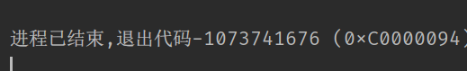

我们以前都没有想过main()的返回值代表什么，如何使用它们。经过研究，我们得到了下面的结论:

### main()函数的`return`返回值代表什么?

这个返回值遵循一定的**协议**。在一般的协议中，我们一般使用`0`表示正常运行结束退出，这也是我们大多数时候会使用的返回值:

```c++
return 0;
```

但是，除了`0`以外，我们也可以使用其他的数字作为返回值。下面分为`Windows`和`Linux`两个系统进行说明:

#### Windows

Windows的名义规范(很多应用都在使用嘛?) 退出代码可以在下面的链接查询:

[Win32 System Error Codes](https://learn.microsoft.com/en-us/windows/win32/debug/system-error-codes--0-499-)

这些常量在`WinError.h`头文件中定义，使用时，我们有两种方式，一种是直接`return <错误码>`, 另一种如下:

```c++
#include <cstdlib>

int main(){
	exit(1);
}
```

通过包含`cstdlib`头文件来使用`exit(<错误码>)`函数退出。

除此以外，`Windows`还有一套`NTSTATUS VALUES`。举例说明, 如果我们使用`g++`编译下面的程序:
```c++
int main(){  
    int a = 1;  
    int c = a / 0;  
    return 0;  
}
```

我们将会得到一个运行时错误:



在对应的网站中, 我们可以找到`0xC0000094`错误代码对应的是**除零错误**。链接:

[NT Status Values](https://learn.microsoft.com/en-us/openspecs/windows_protocols/ms-erref/596a1078-e883-4972-9bbc-49e60bebca55)

`NTSTATUS VALUES`也可通过`return`的方式或者`exit`方式来使用。

以上就是`Windows`平台的两种主要错误返回机制。不过，有一点值得注意的是，上面所说的两套机制似乎是相互兼容的。下面的链接说明了两者的联系和区别(网页中还提到了另一种返回码`hresult`，这里我们暂不涉及): 

https://jpassing.com/2007/08/20/error-codes-win32-vs-hresult-vs-ntstatus/

简单来说，两套机制的混合是`NT`内核发展过程中的历史和兼容问题(我们都知道Windows对于老程序的兼容性非常好)，我们也可以通过同样的方式来取的这两套机制返回的错误码。(一种机制取得两套协议下的代码，是否会导致混淆?) 具体获取方式将会在下面说明。在说明之前，先看看`Linux`的错误码定义。

#### Linux

在`Linux`中，类似地，我们也有一套机制来处理返回值, 参考下面的链接:

[Exit Codes](https://tldp.org/LDP/abs/html/exitcodes.html)

同时，`Linux`也在`sysexits.h`头文件中定义了一套返回码:

```bash
$ find /usr -name sysexits.h
/usr/include/sysexits.h
$ cat /usr/include/sysexits.h
```

```c++
/*
 * Copyright (c) 1987, 1993
 *  The Regents of the University of California.  All rights reserved.

 (A whole bunch of text left out.)

#define EX_OK           0       /* successful termination */
#define EX__BASE        64      /* base value for error messages */
#define EX_USAGE        64      /* command line usage error */
#define EX_DATAERR      65      /* data format error */
#define EX_NOINPUT      66      /* cannot open input */    
#define EX_NOUSER       67      /* addressee unknown */    
#define EX_NOHOST       68      /* host name unknown */
#define EX_UNAVAILABLE  69      /* service unavailable */
#define EX_SOFTWARE     70      /* internal software error */
#define EX_OSERR        71      /* system error (e.g., can't fork) */
#define EX_OSFILE       72      /* critical OS file missing */
#define EX_CANTCREAT    73      /* can't create (user) output file */
#define EX_IOERR        74      /* input/output error */
#define EX_TEMPFAIL     75      /* temp failure; user is invited to retry */
#define EX_PROTOCOL     76      /* remote error in protocol */
#define EX_NOPERM       77      /* permission denied */
#define EX_CONFIG       78      /* configuration error */

#define EX__MAX 78      /* maximum listed value */
```

`Linux`中使用两者的方法和`Windows`类似，都是`exit()`和`return`。

### 如何获得返回码

那么，这些代码除了给我们人使用以外，在程序的自动化执行过程中(例如这个返回错误码的进程是另一个进程的子进程，另一个进程获得了这个错误码)，该如何使用呢？这个仍然是随系统而异。

#### Windows

我们可以用`%errorlevel%`来获取上一条命令的运行结果。使用方法如下:

我们首先编译下面的程序到`test.exe`:

```c++
#include <cstdlib>

int main(){
	exit(1);
}
```

然后，我们在命令行中运行这个`text.exe`:

```shell
> test.exe
< 
> echo %errorlevel%
< 1 
```

可以看到，`%errorlevel%`成功捕捉到了上一个运行的指令`text.exe`返回的错误码。
同理，对于上面的**除零报错**程序，我们也可以正确捕捉返回值(这里我们假设输出的可执行文件名字叫`divide_by_zero.exe`):

```shell
> divide_by_zero.exe
(光标闪烁并停顿一段时间, 表示程序可能遇到执行错误)
<
> echo %errorlevel%
< -1073741676
```

正如我们上面所说的, `-1073741676`是`0xC0000094`的十进制表示，也就是说，我们的`%errorlevel%`也成功捕捉到了这个错误返回码。

#### Linux

在`Linux`中，我们可以用类似的机制获得错误码，通过指令变量`$?`:

```bash
echo $?
```

这里`$?`的工作机制和`%errorlevel%`是一样的，都是在上一个指令结束后执行，就可以得到上一个指令的退出代码; 只不过代码的规范和含义不同，参考对应的代码列表即可。


